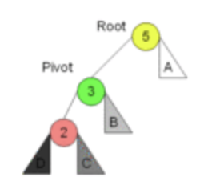
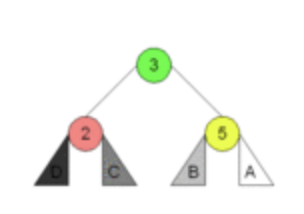
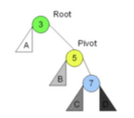
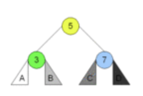
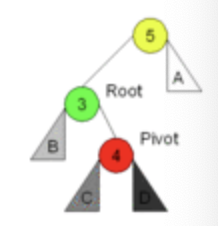
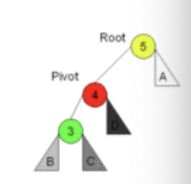
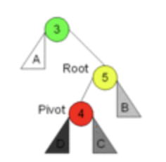
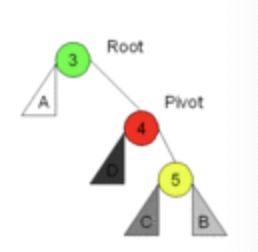

# AVL

> 一种「树」的名字。
>
> 被以发明者 G. M. Adelson-Velsky 和 Evgenii Landis 的名字命名。

## Properties

对一棵保存 $n$ 个节点的 AVL 树来说，其：

* 占用 $O(n)$ 的空间
* 消耗 $O(\log n)$ 的时间来搜寻
* 消耗 $O(\log n)$ 的时间来插入
* 消耗 $O(\log n)$ 的时间来删除

> 一般树的插入、删除不会需要这么长时间；消耗多余时间的原因就是「实现 $O(\log n)$ 的查找」。

AVL 树是最早被发明的「自平衡」、「二叉搜索树」。

> 每个节点的左子树高度和右子树高度差的绝对值如果是 0 或 1，则称此节点平衡；否则，说此节点不平衡。
>
> AVL 树中所有节点都平衡，因此也被称为「高度平衡树」。

## Definition

### Lemma

首先定义 AVL 旋转。这是一种「纠正不平衡」的方式。

不平衡的方式可以分为四种：

1. 左左

以 3 节点为新的中心，转变为新树。

> 这些旋转操作统统可以「递归」完成；即，只要某棵树的某一子树部分出现了这种形态，就可以进行旋转。

2. 右右

跟左左完全类似。

变成这样：

3. 左右

拧巴的这种情况。先左子树才右子树。

这种情况下，需要先对子子树进行一次左旋，变成 1 情况：

然後归化到 1 情况处理。

4. 右左

同样，转化为：

规划到 2 情况处理。

这样，可以在 $O(\log n)$ 的时间内使得子树恢复平衡。

### Insert

插入只需要随便找一个位置塞进去，然後调平即可。

### Remove

删除可以通过「不断旋转」把目标节点转到叶子结点处，然後直接将其删除即可。

### Search

既然是 BST 树，那就简单了；$O(\log n)$ 就够了。

