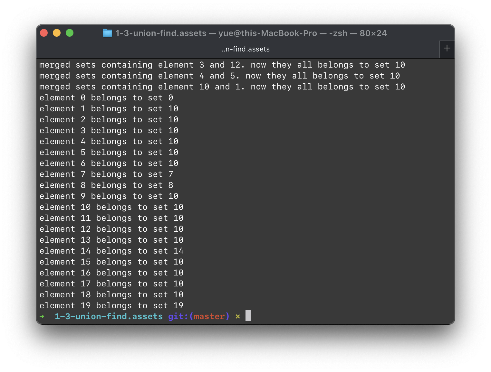
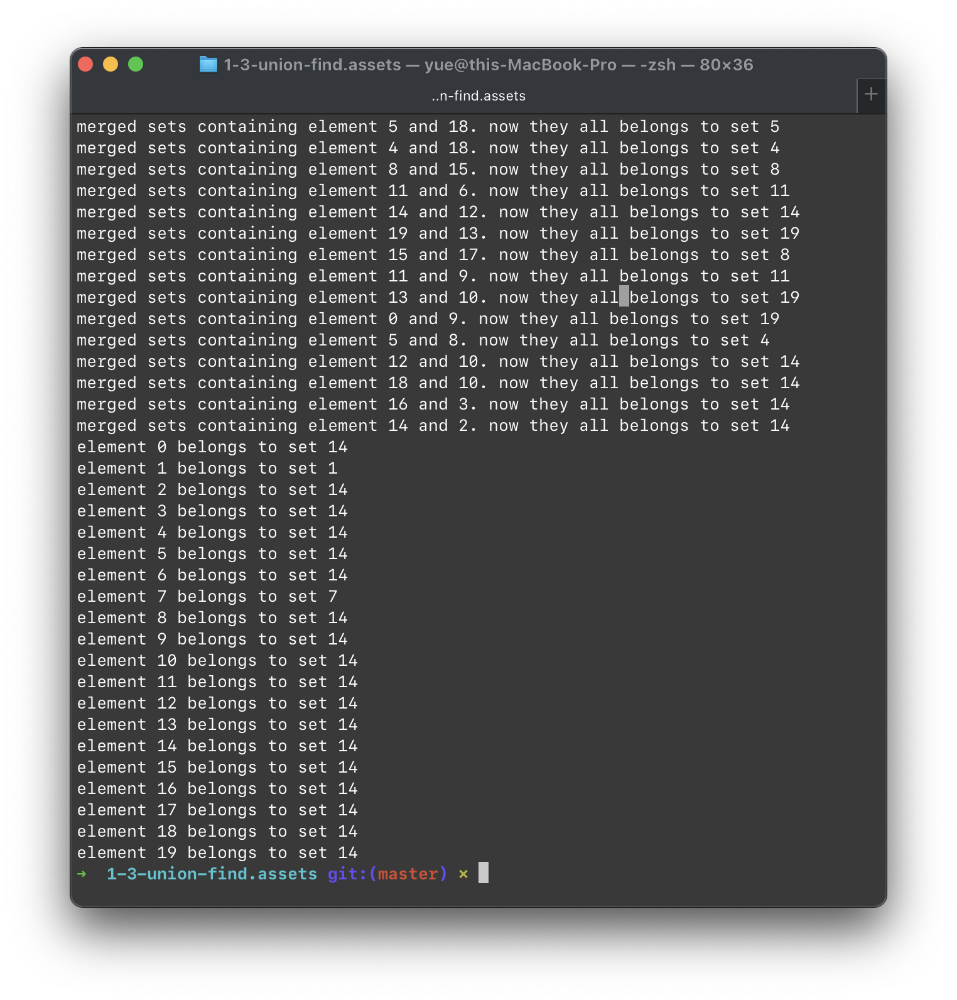
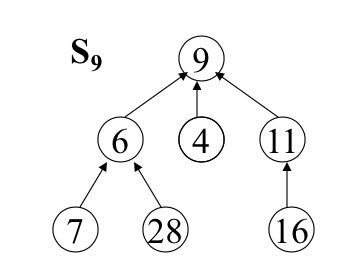
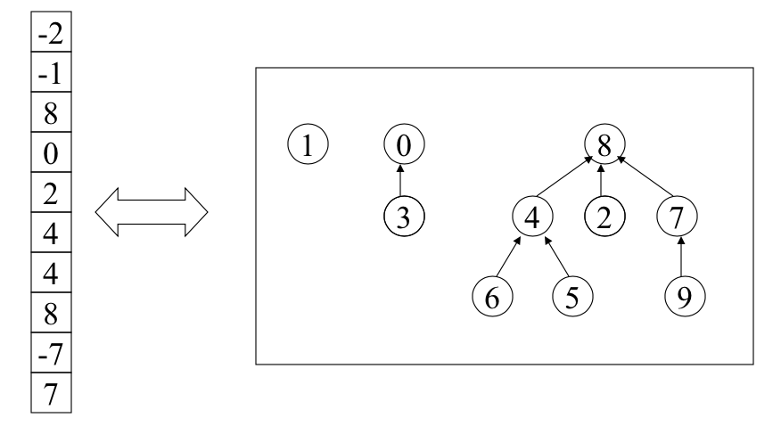
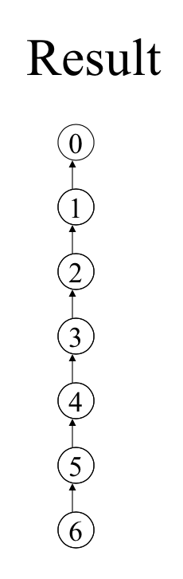
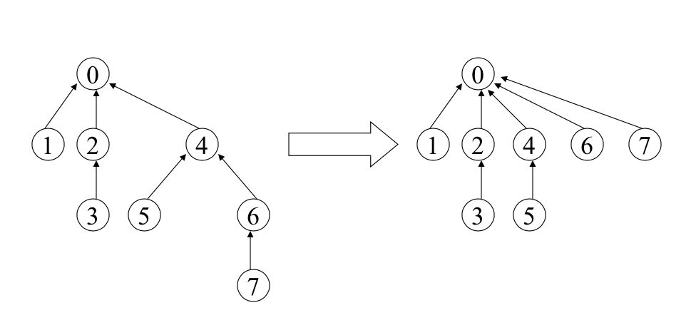

# Lecture 3

> 并查集（Union − Find Set）。

## 并查集

### 接口

```cpp
#include <vector>

template <class T>
class union_find_sets
{
public:
    union_find_sets(const std::vector<T> &init_values);
    T &ufs_union(const T &lhs, const T &rhs);
    T &ufs_find(const T &value);
}
```

初始情况下，提供一系列元素；默认他们各自属于独立的集合中，而且这个集合的名字就是初始元素的名字。

只有两个对外可见的方法：

* `Union`，将两个并查集合并为一个。
* `Find`，提供一个元素，返回该元素所在的那个集合名称。

> 这个 `union_find_sets` 包含的是**并查集**的集合。

### 简化假设

* 初始并查集集合的元素都是数字，而且依次为 `0` 到 `n - 1`。
* 每个并查集的名字都设定为其中一个元素（`int` 类型）的值。

这样，我们提供一个更加简化的接口：

```python
class UnionFindSets:
    def __init__(self, n: int):
        # do init work
        pass

    def union(self, lhs: int, rhs: int) -> int:
        # do union work
        pass

    def find(self, elem: int) -> int:
        # do find work
        pass
```

### 实现

#### 笨蛋实现

我们可以真的用 `set` 来保存并查集，虽然想想都知道这个实现肯定很慢。

```python
#!/usr/bin/env python3


class UnionFindSets:

    def __init__(self, n: int):
        self.sets = {}
        for i in range(n):
            self.sets.append({i: set(i)})

    def union(self, lhs: int, rhs: int) -> int:
        lhs_set_index = self.find(lhs)
        rhs_set_index = self.find(rhs)

        if lhs_set_index is None or rhs_set_index is None:
            return None

        lhs_set = self.sets[lhs_set_index]
        rhs_set = self.sets[rhs_set_index]

        del self.sets[lhs_set_index]
        del self.sets[rhs_set_index]

        self.sets.update({
            # always use left set name
            lhs_set_index: lhs_set.union(rhs_set)
        })

        return lhs_set_index

    def find(self, elem: int) -> int:
        for k, v in sets:
            if elem in v:
                return k

        return None
```



可以得到正确的结果。

#### 优化实现

我们好像没有必要真的维护 `set` 类型的集合，事实上，鉴于我们的 `id` 始终是 `0` 到 `n - 1` 的数字，因此实际上我们只需要用 `n` 长度的一个数组就能记录 UFS 的状况了。

> 数组的第 `i` 个元素的值代表名为 `i` 的元素所在并查集的名称。

> 初始情况下，`payload` 数组应该记录为 `list(range(n))`，也就是 `[0, 1, 2, ..., n - 1]` 这样的。

这样，`find(i)` 就可以简单地实现为返回 `payload_array[i]` 的值了。

> 时间复杂度是 $O(1)$ 级别的。

而 `merge(m, n)` 可以实现为对每一个满足 `payload_array[k] = n` 的 `k`，将 `payload_array[k] = m`。

> 时间复杂度是 $O(n)$ 级别的。



#### 基于树的笨蛋实现

能否实现得更好呢？我们来试着用「树」的概念来优化一下算法。

将每个集合元素想象为一个树中的节点，属于不同集合的元素对应的节点位于不同的树中，而且每个集合的名字就是该树的根节点对应元素名字。



例如，这棵树就表示一个名为「9」的集合，其中包含了 `[9, 6, 4, 11, 7, 28, 16]` 这些元素。

事实上，要表示这棵二叉树也只需要 `n` 个元素的数组就够了。我们规定：节点 `i` 所索引的数组 `payload_array[i]` 代表其父节点的名字；将根节点的 `payload_array[root]` 设定为一个特殊值（在这里，我们将其设定为 `-size`，即这棵树的节点数量的相反数。）。



这里，很显然地，`find` 方法的时间复杂度完全取决于这个节点在树中的深度。而平均的 `find` 复杂度则视树的形态而定。对于一棵非常良好、均匀的树，平均的 `find` 复杂度应该在 $O(\log n)$ 级别；但假如这棵树构造得非常差，以至于退化成了「链表」（每个节点都没有超过一个的子节点），那样平均的 `find` 复杂度就退化到了 $O(n)$ 级别了。

因此，如何设计 `union` 算法就成了优化这种结构的重中之重。假如我们采用最简单的思路，将某一节点的 `parent` 节点 ID 设定为另一个节点以进行 `union`（这样可以在 $O(1)$ 时间内完成），那样很容易造成树越来越长，最後导致 `find` 的复杂度爆炸。



因此，我们有必要在 `Union` 时多做一点事情，优化一下树的结构，让 `Find` 少花点时间。

#### 权重树实现

实际上，我们有一个简单的办法可以避免我们的树退化。那就是，始终将高度较矮的树当作高度较高的树的子树。

> Make the root of the smaller tree the child of the root of the larger tree.

将「一棵较高的树」作为「一棵较矮的树」的子树，会导致结果树的高度增加 1。而反过来就不会增加树的高度。

从数学上来证明，我们可以说，采用权重树实现来对任意 $n$ 个节点进行 UFS 操作，则结果树的高度一定不会超过 $\lfloor \log_2 n \rfloor$。

此时，`Union` 的耗时是 $O(1)$，而 `Find` 的耗时则是 $O(\log n)$。

#### 最後的优化

为了减少 `Find` 的耗时，我们可以定期优化树的结构。

因为我们采用 `payload` 数组来存储树结构，因此我们的树不必拘泥于「二叉」。



例如，进行这样的树变换就可以大大降低 `Find` 的复杂度——让一部分较深的叶子节点直接指向根节点。

这里就不做实现了。

### 效率测试

```shell
done # 笨蛋实现
Total time running <function run_tests at 0x1005998b0>: 8.720962047576904 seconds
done # 优化实现
Total time running <function run_tests at 0x1005998b0>: 8.580347061157227 seconds
done # 树实现
Total time running <function run_tests at 0x1005998b0>: 0.2534818649291992 seconds
done # 权重树实现
Total time running <function run_tests at 0x1005998b0>: 0.037947893142700195 seconds
```

总的来说，对 $n$ 个元素组成的元素做 $\dfrac n 2$ 次 `Union` 和 $\dfrac n 2$ 次 `Find`，最好的实现可以达到 $O(n \log n)$ 的时间复杂度。

名人名言：

While a sequence of $n$ operations does not technically run in linear time, you can’t get much closer.

