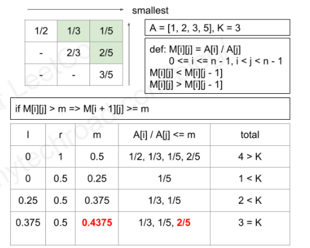

# LC.786

> K-th Smallest Prime Fraction

首先，这些质数比的值并不是完全「位置无关的」（虽然也不是完全相关）。比起「找出 $C_n^2$ 个数中第 $k$ 小的那个」，这个问题存在什么特殊之处呢？

因为给出的全是质数，因此其中一定不存在相等的比（不可能约分）。而且，已经知道只考虑真分数（小于 1 的），所以可以列出这么一张上三角表：

而且，只要往右、往上移动，比值一定会变小。

所以，一定可以找到一个比值 $C_i$，使得小于 $C_i$ 的所有比值都位于这张表的上三角块上。

换句话说，我们可以通过二分搜索的手段，将第 $k$ 小元素的位置缩小到某一条斜对角线上去。

> 不能确定相互关系大小的，不就是从左上到右下的斜对角线吗？
>
> 往右移动，比值一定一点点变小；往上移动，比值也会一点点变小。沿着次对角线从左下往右上移动，那更不用说了。
>
> 但是，这里，斜对角线上的大小关系是不确定的。

因此，我们只需要 $O(\log k)$ 的时间就能锁定目标元素所在对角线的位置。

因为这条对角线上最多也只有 $n$ 个元素，是 $O(n)$ 级别的。要找出其中第 $k$ 大的元素，就算强行排序也只需要花费 $O(n \log n)$ 的时间而已。

> 因为 $k$ 本身不大于 $\dfrac {n (n - 1)} 2$，因此$\log k$ 也不大于 $\log n + \log{(n - 1)} - \log 2$。也就是说，$O(\log k)$ 比起 $O(n\log n)$ 来说，是微不足道的。

总的时间复杂度不会差于 $O(n \log n)$。